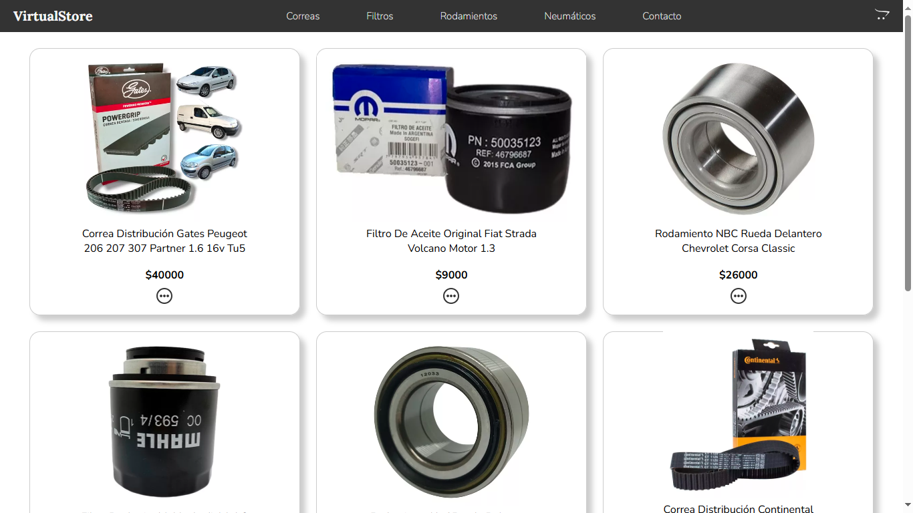

# Coderhouse

## Curso de React Js

### "proyectoFinal/**VirtualStore**"

</img>

#### Características

*VirtualStore es una aplicación web desarrollada con React.js, creada para alojar sitios web, estilo e-commerce, para nuestros clientes.*
*Interfaz de usuario moderna, escalable y personalizable.*

#### Tecnologías Utilizadas

*Javacript, React Js, CSS, Bootstrap, ChatGPT, Firebase*

#### Estado del Proyecto

*La aplicación está en desarrollo y actualmente está disponible en versión beta. Esta versión muestra, a modo de ejemplo, una tienda virtual destinada a la venta de autopartes, con las siguientes características:*

*Secciones clickeables: Diferentes categorías y productos.*

*Diseño minimalista: Estética limpia y moderna.*

*Intuitiva de utilizar: Fácil navegación para los usuarios.*

*Manejo de órdenes de compra: A través de Firebase.*
